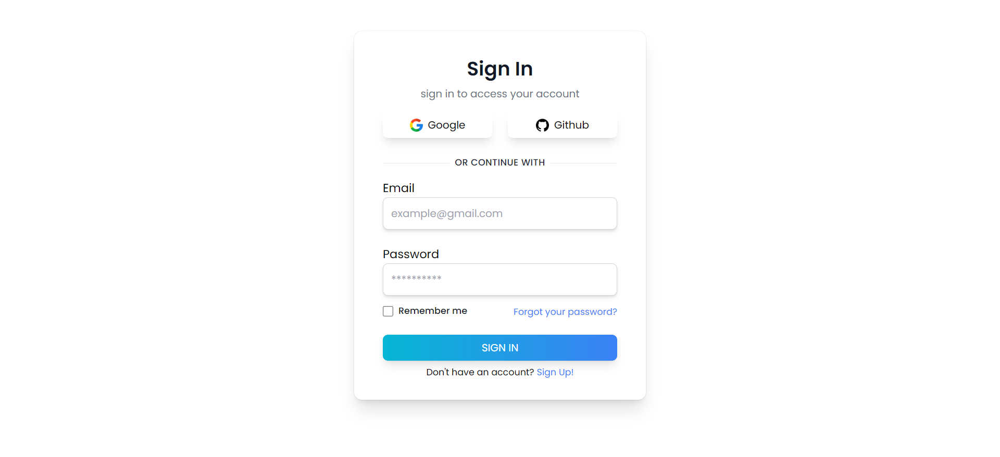

   
  
   
   

<h2 align="center">Login form -  Tailwind CSS</h2>

  creating minimalist login form using tailwind CSS
   
  <a href="https://tailwindcss.com">Tailwind CSS</a> is a utility-first CSS framework for rapidly building custom user interfaces.
   

<h2>Screenshot</h2>

